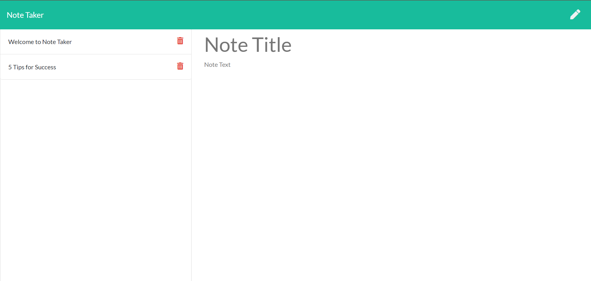

# Note Taker

- A simple note taking program where the user can save notes, delete notes, and look up old notes.

[Note Taker Link ](https://boiling-basin-25246.herokuapp.com/)

## Tools Used

- http

- Express.js

- Routing

- Postman

- HTTP POST requests

- Express.static()

## Usage

- Creating a note: Add text to the Title and the body for the save button to appear in the top right hand side. Click save button to save note to server.

- Checking old notes: Click on the note title on the left hand side

- Deleting notes: Click on the small delete button next to a note on the left hand side

## Limitations

- Being a concept project, this program is limited. The deployed heroku sight is linked to a single server, which means any notes saved are visible and can be changed by the public. No private data should be stored here, but it could be used to leave other fun notes for people to find.

## Future Development ideas

- allow the user to edit current notes

- create a tasks page with due dates

## My Info

